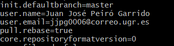
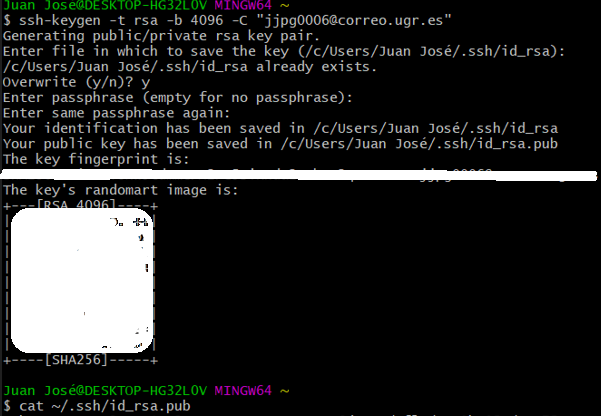
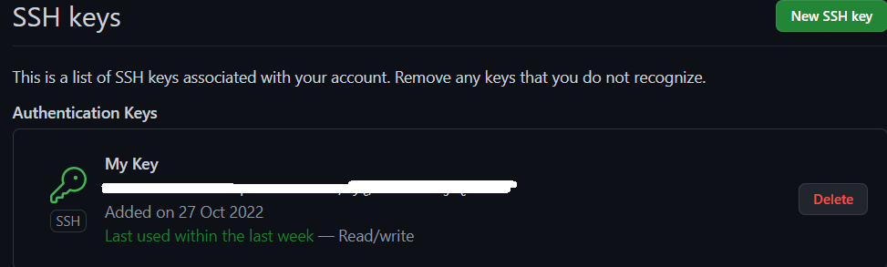
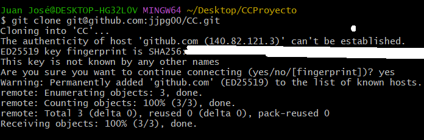
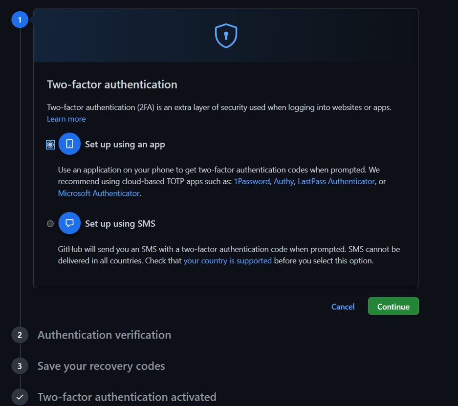
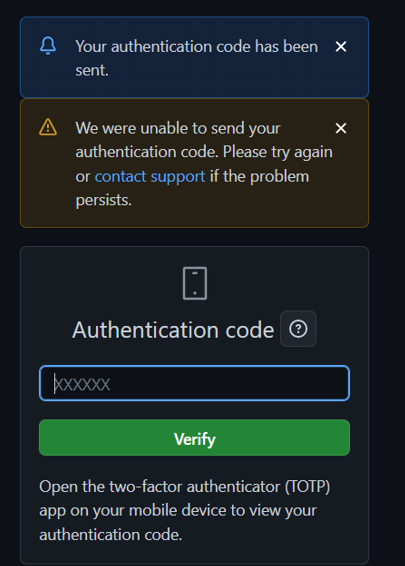

1. En primer lugar configuraraemos nuestro usuario y nuestro email en git a través de los comandos: `git config --global user.name` y `git config --global user.email` para que aparezca nuestro email y usuario correctamente a la hora de trabajar con el repositorio, además pondremos la opción de pull rebase a **true** a través del comando `git config --global pull.rebase true`. Tras esto, usaremos el comando `git config --list` para comprobar que lo hemos configurado correctamente.
  

2. La cuenta de Github se ha creado nueva ya que no estaba creada previamente, el nombre de este email es: **jjpg0006@correo.ugr.es**.

3. Añadimos nombre, foto de perfil, localidad y universidad en nuestro perfil de Github.

4. En el siguiente paso crearemos un par de claves SSH y las subiremos a Github, este comando nos permitirá generar la llave asociándola al correo pasado por parámetro. Los archivos de configuración para las claves ya los tenía creados previamente por lo que no he necesitado configurarlo nuevamente. Para conseguir estas llaves lo lograremos usando el comando `ssh-keygen -t rsa -b 4096 -C "parametro@email.com"`. Tras esto, usamos el comando `cat ~/.ssh/id_rsa.pub` para obtener la clave y poder copiarla para pegarla y configurarla en Github.

5. Para añadir la llave en Github, debemos irnos a la siguiente ruta: Github -> Profile -> Settings -> SSH y GPG Keys -> New SSH Key. Tras esto pegamos la llave previamente generada, la pegamos y le ponemos un nombre y la configuramos como "Authentication Key". Tras esto nos aparecerá creada nuestra llave donde podemos ver la fecha de creación, su SHA256, último uso y nombre.

6. Tras esto creamos nuestro repositorio dándole al símbolo "+" y dando click en **New Repository**. Donde pondremos el nombre, pediremos que cree un fichero README y lo estableceremos como público, entre otras opciones de configuración.
Tras esto haremos un git clone del repositorio y podremos trabajar con este.

7. Tras esto crearemos los ficheros necesarios para el desarrollo de la documentación y la práctica, como el fichero .gitignore, los .md necesarios para la documentación y las imágenes que estos contrendrán.

8. Crearemos un segundo factor de autenticación en Github a través de una aplicación (Github ofrece más alternativas como SMS) en la ruta https://github.com/settings/security. Hay varias aplicaciones para elegir, pero se optado por elegir la app **Authy**, la cual genera tokens seguros de 2 step verification. Por último la activaremos estableciéndola en **enabled**.

