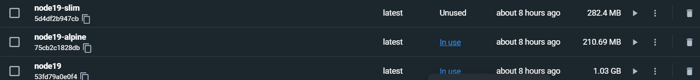

### Elección correcta y justificada del contenedor base.

Como estamos usando JavaScript y Nodejs instalaremos una de las imágenes oficiales que podemos encontrar en: https://hub.docker.com/_/node.

He decidido para mayor realismo descargar la versión 19 ya que es la más actual hasta la fecha, ya que las mayorías de aplicaciones en la nube se destacan por la escalabilidad y es importante tener una versión que perdure en el tiempo. Además es la opción recomendada.
En realidad, sin embargo, hubiera servido una anterior.

Una vez escogida la versión, dentro de las opciones se nos ofrece muchas como puede ser alpine,buster,slim o la normal.
Para asegurarnos de escoger la elección se ha hecho pruebas con algunos de ellos y se ha buscado documentación sobre ellas: https://medium.com/swlh/alpine-slim-stretch-buster-jessie-bullseye-bookworm-what-are-the-differences-in-docker-62171ed4531d.

1. Buster: stretch, buster o jessie son nombres en clave para diferentes versiones de Debian. No ofrece ventajas en particular respecto a la normal por lo que la descartamos.

2. Slim: Esta imagen generalmente solo instala los paquetes mínimos necesarios para ejecutar su herramienta en particular. 

Al dejar de lado las herramientas menos utilizadas, la imagen es más pequeña. Sin embargo en ocasiones aparecen errores que en la normal no.

3. Las imágenes de Alpine se basan en el proyecto Alpine Linux, que es un sistema operativo creado específicamente para su uso dentro de contenedores. Durante mucho tiempo, estas fueron las variaciones de imagen más populares debido a su pequeño tamaño.
Esta imagen es la más recomendada si el espacio es una preocupación.

Por ser muy ligero en tamaño y su creación especifica para contenedores, elegiría en la versión de alpine ya que también al ser más pequeña tardará menos tiempo en desplegarse.
Además nuestro proyecto es sencillo y no necesitamos la mayoría de cosas que nos ofrece la versión normal ya que al ser genérica ofrece muchas herramientas para mucho tipo de aplicaciones y necesidades.

Sabiendo esto hice cree 3 dockers uno con node normal, otro con alpine y otro con slim con fine para compararlos y tomar una decisión final.



La versión alpine fue la más liviana y además funcionaba a la perfección, por eso junto a los motivos expuestos arriba, fue la elegida.

### Dockerfile correcto, siguiendo buenas prácticas, y adaptado de forma correcta a las clases o módulos que se están testeando

En primer lugar eligiremos el contenedor a usar y la versión que queremos usar, siendo en este caso la versión 19 alpine de node como se ha comentado en el apartado anterior.
```
FROM node:19-alpine
```

Necesitamos cual será nuestro directorio de trabajo que en este caso diremos que se encontrará en una carpeta /app
```
WORKDIR /app
```

Primero necesitamos copiar los archivos package.json y package-lock.json la razón de porque hay que empezar por estos dos archivos es porque en package json se encuentran unas dependencias a nivel de aplicación que necesita Node para funcionar ya que docker solo nos ofrece unas dependencias a nivel de sistema.
En el primer argumento especificamos que nos copie los dos archivos que empiecen por package y acaben en .json y en el segundo argumento el directorio de trabajo.
```
COPY package*.json ./
```

El siguiente paso es usar el npm install para que nos instale las dependencias. Tras esto conseguiremos la carpeta node-modules dentro del container y ya puede ejecutar el código al existir las dependencias necesarias.
```
npm install
```

Luego tendremos que copiar todo nuestro código javascript dentro del contenedor. 
```
COPY . .
```

Cuidado, como copiaremos todo el contenido de la carpeta dentro y especificaremos en un archivo .dockerignore las carpetas que no queramos copiar ya que estamos copiando todo al usar ".".
Quedando nuestro archivo .dockerignore de la siguiente manera: (ignoraremos el log del debugger y la carpeta de las depedencias)
Nota se hizo la imagen cuando solo había archivos del proyecto y no habia documentación etc..
```
node_modules
npm-debug.log
```

Ahora daremos un puerto por el que poder acceder a la aplicación a través del contenedor.
```
EXPOSE 6000
```

Ahora con el comando CMD pasaremos el comando que queremos ejecutar junto a sus argumentos, en este caso al querer ejecutar los tests sería de la siguiente forma:
```
CMD ["npm" , "test"]
```

Luego para construir el contenedor y ejecutarlo solo tenemos que usar los siguientes comandos.

```
docker build -t jjpg00/cloudcomputing .
docker run -t -v `pwd`:/app/test jjpg00/cloudcomputing
```


### Contenedor subido correctamente a Docker Hub y documentación de la actualización automática
https://hub.docker.com/repository/docker/jjpg00/cloudcomputing
Tras el siguiente comando, comprobamos que lo hemos subido correctamente.
```
 docker push jjpg00/cloudcomputing
```


Para conseguirlo se ha hecho uso de la herramienta actions que nos ofrece Github. Para ello tendremos que configurar un archivo .yml dentro de las carpetas .github/workflows.
El nombre del archivo será deploy-image.yml.

En el todos los parámetros los recogerá a través de variables, por ejemplo el nombre de la imagen será el nombre del repositorio de github.

```
IMAGE_NAME: ${{ github.repository }}
```
y para hacer el registro cogeremos nuestro usuario y un token para logearnos.
```
      username: ${{ github.actor }}
          password: ${{ secrets.GITHUB_TOKEN }}
 ```
 
 Para la automatización haremos unos tags basados en la rama en la que estemos y luego también añadiremos el tipo sha para que se distingan uno de otros inequívocamente.
 Aquí podemos ver el código añadido, podemos ver la de docker y la de github:
 
 
 
 
 Y aquí podemos comprobar el resultado:
 
 
 Para la automatización en Github, se ha creado un archivo llamado deploy-imageDocker.yml. Para su funcionamiento se han creado dos variables DOCKER_USERNAME y DOCKER_PASSWORD Para su funcionamiento. Esto se encuentra en Settings del proyecto-> Security -> Secrets y finalmente las añadimos.
### Uso de registros alternativos y públicos de contenedores (como GitHub Container Registry)
 La opción elegida ha sido GitHub Container Registry ya que estamos utilizando Github para el control del proyecto y es muy fácil y rápido de crearlo ya que únicamente hay que configurar el archivo .yml de forma correcta dentor de .github/workflows.
 Github Container Registry puede almacenar y administrar imágenes Docker y OCI en el registro de contenedores, que utiliza el espacio de nombres del paquete https://ghcr.io, especificado en nuestro archivo .yml. El archivo se puede crear manualmente o a través de la sección actions dentro de nuestro repositorio de Github.
 
 Tras ejecutar la action y acabar correctamente, podemos observar que nuestra imagen aparece en el repositorio:
 
 