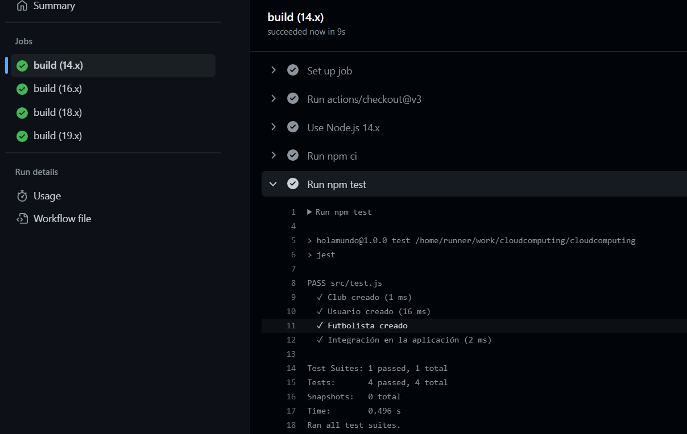

### Integración continua funcionando y correcta justificación de la misma

En primer lugares haremos una comparación de los sistemas de integración continua para saber cual es la más adecuada a nuestro proyecto.
Para esto veremos las características y ventajas que ofrece cada uno de estos.

1. **Github Actions**: Puede crear, compartir, reutilizar y bifurcar sus prácticas de desarrollo de software.
Está completamente integrado con GitHub, lo que lo hace manejable desde un solo lugar.
Puede realizar pruebas de varios contenedores agregando soporte para Docker.
Puede elegir entre varias plantillas de CI o incluso crear las suyas propias.
Incluye 2000 minutos/mes de compilación gratuitos para todos sus repositorios privados.
Las actualizaciones frecuentes de código también facilitan la combinación de cambios de diferentes miembros de un equipo de desarrollo de software. Esto es excelente para los desarrolladores, que pueden pasar más tiempo escribiendo código y menos tiempo depurando errores o resolviendo conflictos de fusión.
GitHub ejecuta sus pruebas de CI y proporciona los resultados de cada prueba en la solicitud de extracción, para que pueda ver si el cambio en su rama introduce un error.
Cuando configura CI en su repositorio, GitHub analiza el código en su repositorio y recomienda flujos de trabajo de CI basados ​​en el lenguaje y el marco en su repositorio. Por ejemplo, si usa Node.js , GitHub le sugerirá un flujo de trabajo de inicio que instala sus paquetes de Node.js y ejecuta sus pruebas.

2. **Cicle CI**: Es fácil de configurar y se puede usar con sistemas populares de control de versiones como GitHub, Bitbucket y más.
Ofrece canalizaciones de CI/CD como 'Flujos de trabajo'.
Es compatible con la mayoría de los lenguajes de programación populares listos para usar.
Para reducir el tiempo de compilación, las compilaciones se pueden dividir y equilibrar en varios contenedores.
Las pruebas paralelas en CircleCI ayudan a ejecutar pruebas en paralelo entre diferentes ejecutores.
Las pruebas se pueden separar utilizando datos de tiempo que ayudan a reducir aún más el tiempo involucrado en la ejecución de la prueba.
CircleCI Server, que es la oferta local de CircleCI, se puede integrar con herramientas populares de terceros como GitHub Enterprise, LambdaTest, Coveralls y más.
CircleCI Server admite plataformas en la nube ampliamente utilizadas como AWS, Google Cloud, Azure y más.
CircleCI Orbs, que son fragmentos de código reutilizables, ayudan a automatizar procesos repetitivos y aceleran la integración con herramientas de terceros.

3. **Travis CI**: Travis CI admite una variedad de lenguajes de programación (es decir, un total de 30), incluidos Java, C #, Julia, Python y más.
Las empresas que buscan más privacidad y soluciones seguras pueden optar por Travis CI Enterprise, una herramienta autohospedada que se integra a la perfección con GitHub y Bitbucket.
Las canalizaciones de CI/CD utilizan una sintaxis YAML patentada, con una integración perfecta con las herramientas de GitHub Enterprise.
Puede usar la variante Cloud (o SaaS) de Travis CI para proyectos de código abierto y empresas con equipos pequeños.
Proporciona tiempos de ejecución en plataformas populares como Linux, macOS y Windows.
La función de matriz de compilación en Travis CI le permite realizar compilaciones paralelas en una variedad de combinaciones que comprenden diferentes entornos, idiomas y tiempos de ejecución.
Travis CI Enterprise admite la integración con plataformas en la nube populares como AWS, Google Cloud, Kubernetes, Azure y más.
La integración con herramientas de prueba de navegador cruzado como LambdaTest ayuda a realizar pruebas en diferentes navegadores, plataformas y dispositivos (emuladores).

4. **Drone CI**: Las canalizaciones se ejecutan en contenedores Docker aislados, lo que garantiza que las compilaciones no entren en conflicto.
Drone CI (Cloud and Enterprise) puede integrarse perfectamente con herramientas SCM populares como GitHub, Bitbucket y GitLab.
Drone CI puede funcionar con cualquier lenguaje de programación, base de datos o servicio para ejecutarse dentro de un contenedor Docker.
Admite la compilación y las pruebas en paralelo, incluidas las pruebas entre navegadores a través de la integración con LambdaTest.
Drone CI se puede instalar en cuestión de minutos, ya que solo requiere descargar la imagen oficial de Docker e instalarla.
Drone Cloud es completamente gratuito para proyectos de código abierto.
Drone CI (Cloud and Enterprise) tiene un ecosistema de complementos en crecimiento donde puede encontrar complementos para la integración en la nube, informes, pruebas, notificaciones y más.

5. **Jenkins**: Con esta herramienta los desarrolladores pueden detectar y solucionar problemas de integración, mucho más fácil y de forma constante, evitando estar a ultima hora teniendo problemas sin lograr ver en que parte del código está el error.
Jenkins se puede usar como un simple servidor de CI o se puede convertir en el centro de entrega continua para cualquier proyecto.
Jenkins está basado en Java, listo para ejecutarse, con paquetes para Windows, Mac OS X y otros sistemas operativos tipo Unix.
Se puede configurar fácilmente a través de su interfaz web, que incluye verificaciones de errores
Jenkins se integra con prácticamente todas las herramientas en la integración continua

**Justificación**: Todos los distintos sistemas de integración continua ofrecen una gran cantidad de ventajas y es muy difícil decantanse por uno. 
Para este proyecto, debido a que es un sistema simple se ha optado por Github actions ya que es el más fácil y rápido de implementar por el entorno en el que se está desarrollando y familiaridad de uso con él.
Si fuera un proyecto más complejo, podríamos escoger un sistema que repartiera la carga de trabajo que supone la integración continua en más de una plataforma, pero en este caso, con Github actions es suficiente.
Con Github actions podremos hacer testing del código fuente que se sube al proyecto de forma simple y automática para avisar si ha pasado todas las condiciones de nuestro archivo de tests en el propio repositorio.
Además es muy adecuado ya que ofrece herramientas para hacer la integración fácilmente en contenedores.

El segundo sistema elegido por razones rapidez y facilidad es CicleCI ya que permite una fácil integración con Github ya que nos permite registrarnos automáticamente en él con la cuenta Github y tras esto nos crea automáticamente el fichero necesario para la integración.
Es idóneo para este proyecto y además podemos probar como es ejecutar los tests en una plataformas de terceros. También es interesante ya que permite hacer ejecuciones en paralelo para ahorrar tiempo, he querido probar esta herramienta ya que en un futuro en un proyecto real se podría usar ya que es buena para proyectos grandes.

En definitiva al ser nuestro proyecto pequeño se han tomado las opciones más sencillas, rápidas y familiares para probarlas y aprender de estas.

### Github Actions

Para integrarlo con Github Actions ha sido necesario crear en la carpeta .github/workflows dos archivos: uno llamado *integracion.yml* y otro *integracionDocker.yml*
Con el primero lograremos ejecutar las github actions desde el propio código que subimos al repositorio, desde el segundo conseguiremos hacerlo desde nuestro contenedor.

El contenido de estos archivos es muy simple:
integration.yml
```
name: Despliegue aplicación en javascript

on: push

jobs:
  build:

    runs-on: ubuntu-latest

    strategy:
      matrix:
        node-version: [14.x, 16.x,18.x, 19.x]

    steps:
      - uses: actions/checkout@v3
      - name: Use Node.js ${{ matrix.node-version }}
        uses: actions/setup-node@v3
        with:
          node-version: ${{ matrix.node-version }}
          cache: 'npm'
      - run: npm ci
      - run: npm test
```
Con name definimos el nombre que va la actions para que sepamos localizarla.

on: push lo usaremos para indicar que se haga siempre que se haga un push a nuestro repositorio, para comprobar que todo está correcto.

Tras eso, lo construiremos e indicaremos que se se ejecuta en la última aplicación de ubuntu, luego elegimos que se ejecute en 4 distintas versiones de node js ya que es una buena práctica que se ejecute en un gran número de versiones distintas para comprobar que funciona correctamente en cada una de ellas.
Por último hacemos un checkout y usamos npm ci que es similar que npm install pero especial para contenedores y entornos de integración continua. Tras eso ejecutamos los tests con npm test.


El archivo para ejecutarlo en el contenedor será muy similar únicamente hay que añadir que son tests de contenedores y ejecutar el comando docker run en nuestro contenedor.
```
  container-tests:

    runs-on: ubuntu-latest

    steps:
       - uses: actions/checkout@v3
       - run:  docker run -t -v `pwd`:/app/test jjpg00/cloudcomputing

```
Para más información consultar el siguiente vídeo: https://www.youtube.com/watch?v=azzRDem_p5k.

Aquí vemos que los tests se ejecutan en Github actions correctamente.


Ahora vemos la ejecución dentro del docker.


### Configuración de algún sistema de integración continua adicional
Como se ha comentado y justificado antes se usará CircleCI

Tras registrarnos con nuestra cuenta Github, únicamente hay que elegir el proyecto que queremos integrar y ellos nos crearán automáticamente el archivo y la carpeta para permitir la integración continua.
El archivo se encuentra dentro de la carpeta .circleci/ en el archivo config.yml.

Aquí vemos como tras un sencillo pull request, nos crea el archivo necesario para la integración.


Aquí comprobamos que funciona correctamente dentro de las pipelines del proyecto: https://app.circleci.com/pipelines/github/jjpg00/cloudcomputing


### Aprovechamiento del contenedor de Docker generado en el hito anterior en alguno de los sistemas de CI.
Como se ha comentado en el apartado de Github Actions, hemos aprovechado el docker para la ejecución de los tests. El archivo se llama *integracionDocker.yml* en la carpeta .github/workflows.


Como solo se pide en alguno de los sistemas, damos por finalizado este apartado.