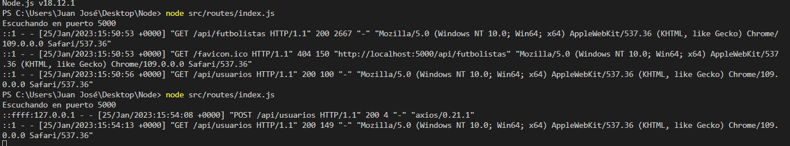

### Justificación técnica del framework elegido para el microservicio.
La herramienta elegida para el framework es Express.

De forma general.
Ahorra mucho tiempo de codificación casi a la mitad y aún hace que la web y que las aplicaciones móviles sean eficientes.
Otra razón para usar express es que está escrito en javascript, ya que javascript es un lenguaje fácil, incluso si no tiene una experiencia previa conocimiento de cualquier idioma.

Los beneficios más importantes específicamente y el porqué elegí esta herramienta es por estas siguientes características:
1. Tiempo eficiente
2. Rápido
3. Económico
4. Fácil de aprender
5. Asincrónico

### Diseño en general del API, las rutas (o tareas), tests y documentación de todo, justificando como se ajustan a las historias de usuario, de forma que reflejen correctamente un diseño por capas que desacopla la lógica de negocio del API.

1. Get rutas
	1. /api/futbolistas : Observar todos los futbolistas 
	[H03] (https://github.com/jjpg00/cloudcomputing/issues/3) [H02] (https://github.com/jjpg00/cloudcomputing/issues/2) 
	2. /api/clubes : Observar todos los clubes 
	[H03] (https://github.com/jjpg00/cloudcomputing/issues/3) [H06] (https://github.com/jjpg00/cloudcomputing/issues/6)
	3. /api/usuarios : Observar todos los usuarios
	4. /api/futbolistas/valoracion/:valoracion  : Observar todos los futbolistas con una valoración general 
	[H05] (https://github.com/jjpg00/cloudcomputing/issues/5)
	5. /api/clubes/valoracion/:valoracion : Observar todos los clubes con una valoración general
	6. /api/futbolistas/atributo/aceleracion/:acceleration Observar todos los futbolistas con un atributo específico 
	[H05] (https://github.com/jjpg00/cloudcomputing/issues/5) [H01] (https://github.com/jjpg00/cloudcomputing/issues/1)
	7. /

2. Post rutas
	1. /api/clubes : Crear clubes 
	[H06] (https://github.com/jjpg00/cloudcomputing/issues/6)
	2. /api/usuarios : Crear usuarios
	3. /api/jugadores: Crear jugadores 
	[H08] (https://github.com/jjpg00/cloudcomputing/issues/8)

3. Put rutas
	1. /api/clubes/actualizar : Actualizar clubes

4. Delete rutas
	1. /api/futbolistas/borrar/:borrar : Borrar futbolistas
	2. /api/clubes/borrar/:borrar : Borrar clubes
	
Nota: No se ha hecho un post de usuarios porque tiene una cantidad inmensa de parámetros y se ha escogido búsquedas por un atributo determinado así por cual se podía haber cogido cualquier otro. Cumpliendo también [H07] (https://github.com/jjpg00/cloudcomputing/issues/7) (no se ha implementado porque es gigante como se ha comentado).
Hemos cumplido con toda la funcionalidad que se propuso al principio del proyecto al poder crear usuarios jugadores y clubes y hacer búsquedas atendiendo a lo necesario por el usuario. Además de permitir registrar los usuarios.


### Uso de logs, incluyendo justificación del framework y herramienta elegida.
Para el uso de log se ha usado la librería Morgan.

 Morgan es un middleware  de Node.js y Express para registrar solicitudes y errores HTTP, y simplifica el proceso.

 Se ha elegido por la simplicidad y adecuación al proyecto y que se pueden ver los resultados en tiempo real sin tener que acceder a un archivo en concreto, siendo así muy cómodo de usar y sencillo.

Aquí podemos ver como nos ofrece los resultados a tiempo real de forma sencilla y cómoda.
 

Para usarlo solo tenemos que usarlo en combinación con nuestro framework express.

```
const morgan = require('morgan')
const app = express()
app.use(morgan('combined'))
```